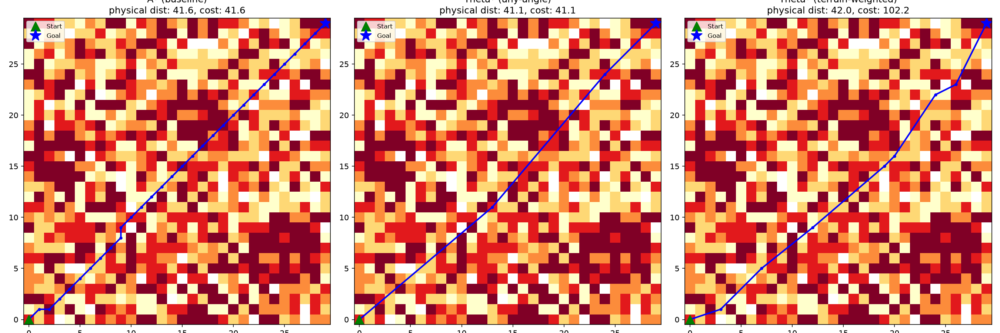

# Terrain-Weighted Path Planning Simulation

A Python simulation comparing standard A*, any-angle Theta*, and a terrain-cost-weighted variant of Theta* for path planning on a simulated grid environment.

**Author:** Prachi Kumari — [GitHub: Sanguine21](https://github.com/Sanguine21)

## What it does

1. Generates a 30x30 grid where each cell has a random terrain difficulty score (1 = flat ground, 5 = rough/hard terrain), plus a few impassable obstacle cells.
2. Finds a path from one corner to the other using three methods:
   - **A\*** — standard grid search, cost based on distance only.
   - **Theta\*** — any-angle search that uses line-of-sight shortcuts to produce shorter, smoother paths than A*.
   - **Terrain-weighted Theta\*** — the same any-angle search, but path cost also factors in the terrain difficulty crossed along each segment, so the planner prefers easier ground even if that means a longer physical path.
3. Visualizes all three paths on the terrain grid and compares path length, total cost, and computation time.

## Example result

Running with `seed=85` produced:

| Method | Steps | Cost | Time |
|---|---|---|---|
| A* (baseline) | 31 | 41.6 | 0.30 ms |
| Theta* (any-angle) | 4 | 41.13 | 0.84 ms |
| Theta* (terrain-weighted) | 9 | 102.19 | 41.30 ms |

The terrain-weighted planner routes around the highest-cost terrain, accepting a longer physical path in exchange for lower traversal difficulty. Changing the random seed changes the terrain layout and the resulting numbers, confirming the paths are computed live rather than fixed.



## File structure

```
terrain-weighted-path-planning/
├── terrain_planner.py   # Main script: grid generation, A*, Theta*, terrain-weighted Theta*, visualization
├── requirements.txt     # Python dependencies
├── comparison.png        # Example output image
└── README.md
```

## How to run it

Requirements: Python 3.9+

```bash
pip install -r requirements.txt
python terrain_planner.py
```

This prints the comparison results to the terminal and saves `comparison.png` in the same folder. To test on a different random terrain, change the `seed` value passed to `build_grid()` near the bottom of the script.

## References

- A. Nash, K. Daniel, S. Koenig, and A. Felner, "Theta*: Any-angle path planning on grids," *Journal of Artificial Intelligence Research*, vol. 39, pp. 533-579, 2010.
- P. E. Hart, N. J. Nilsson, and B. Raphael, "A Formal Basis for the Heuristic Determination of Minimum Cost Paths," *IEEE Transactions on Systems Science and Cybernetics*, vol. 4, no. 2, pp. 100-107, 1968.
